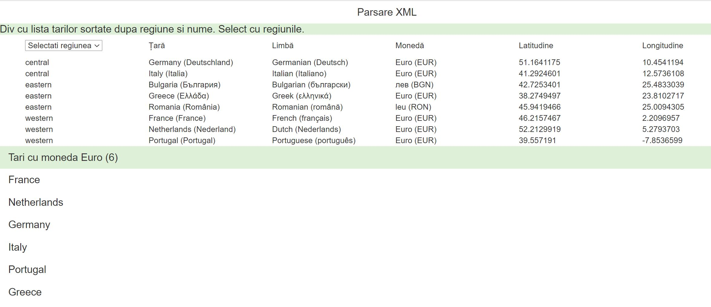

# Tari - parsare XML 

IN : Scriptul citeste un fisier xml cu structura : 
<countries>
	<country zone="eastern">
		<name native="România">Romania</name>
		<language native="română">Romanian</language>
		<currency code="RON">leu</currency>
        <map_url>https://www.google.ro/maps/place/Romania/@45.9419466,25.0094305,7z/data=!3m1!4b1!4m2!3m1!1s0x40b1ff26958976c3:0x84ef4f92a804b194?hl=en</map_url>
 	</country>
     ..
</countries>

OUT :

1. Afișeaza toate informațiile din el într-un tabel, ordonate după regiune și numele în engleză al țărilor.
    Afisarea tabelului se va face folosind div-uri si nu tag-ul  table .

    Notă: informația din coloanele Latitudine și Longitudine trebuie să fie extrase din nodul map_url folosind Regex. De exemplu, pentru România, cele două informații sunt cu bold în link:

    https://www.google.ro/maps/place/Romania/@45.9419466,25.0094305,7z/data=!3m1!4b1!4m2!3m1!1s0x40b1ff26958976c3:0x84ef4f92a804b194?hl=en

    latitudinea: 45.9419466
    longitudinea: 25.0094305

2. Folosind sintaxa XPath, se extrage și se afișeaza sub tabelul de mai sus numele țărilor care au moneda “Euro”.

3. Se adauga un filtru in header-ul tabelului, pe coloana Regiune. Filtrul va fi de tip dropdown si va contine valorile: choose(valoarea default), western, central si eastern. In functie de valoarea selectata in dropdown, se vor afisa doar tarile care contin respectivul atribut (ex. Pentru eastern afisam Romania, Bulgaria si Greece).
 

# Countries
Read XML files and generate div with data. 
Get XML nodes that have a certain value of an attribute using XPATH.